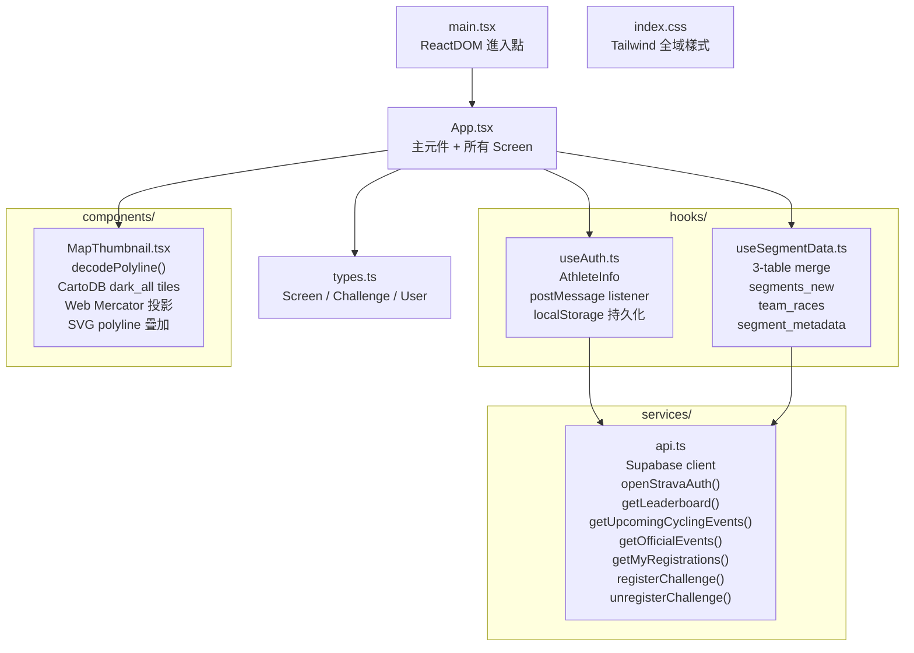

# CLAUDE.md

This file provides guidance to Claude Code (claude.ai/code) when working with code in this repository.

## 基本設定

- **語言**：所有回應、文件、註解皆使用**繁體中文**
- **專案路徑**：`/Volumes/OWC 2T/ClaudeCode/Sitich-TCU小幫手`
- **隸屬工作區**：`/Volumes/OWC 2T/ClaudeCode`（MyObsidian vault 管理）
- **GitHub**：`https://github.com/TCUnion/Sitich-TCU-`
- **上游參考**：`https://github.com/samkhlin/stitch-STRAVATCU`（Google AI Studio 原始設計稿）

## 專案概述

**TCU CHALLENGE** — 自行車挑戰社群平台

Google Stitch 生成的前端介面，整合 Gemini AI。功能包含：
- 挑戰賽瀏覽與報名
- 個人成績追蹤（計時、爬坡、繞圈賽等）
- 車友社群與排行榜
- AI 助理（Gemini API）

## 技術棧

| 項目 | 技術 |
|------|------|
| 框架 | React 19 + TypeScript |
| 建構工具 | Vite 6 |
| 樣式 | Tailwind CSS v4 |
| 動畫 | Motion (Framer Motion) |
| AI | Google Gemini API (`@google/genai`) |
| 圖示 | lucide-react |
| 後端 | Express（輕量 proxy） |
| 資料庫 | Supabase（PostgreSQL）|
| 認證 | Strava OAuth（popup + postMessage）|

## 模組導覽

| 模組 | 路徑 | 職責 |
|------|------|------|
| 主元件 | `src/App.tsx` | 畫面路由、Layout、底部導覽、所有 Screen 元件 |
| 型別定義 | `src/types.ts` | `Screen`、`Challenge`、`User` 型別 |
| 進入點 | `src/main.tsx` | ReactDOM 掛載 |
| 全域樣式 | `src/index.css` | Tailwind 全域設定 |
| API 服務層 | `src/services/api.ts` | Supabase client、REST API 呼叫 |
| 認證 Hook | `src/hooks/useAuth.ts` | Strava OAuth 狀態（postMessage + localStorage）|
| 路段資料 Hook | `src/hooks/useSegmentData.ts` | 3 張表合併查詢（segments_new、team_races、segment_metadata）|
| 地圖縮圖元件 | `src/components/MapThumbnail.tsx` | Canvas 地圖（CartoDB tiles + Google polyline decode）|

## 環境設定

`.env.local`（已加入 .gitignore）：
```
GEMINI_API_KEY="..."
APP_URL="http://localhost:3000"
VITE_SUPABASE_URL=https://db.criterium.tw
VITE_SUPABASE_ANON_KEY="..."
VITE_API_URL=http://localhost:8003
VITE_BACKUP_API_URL=https://powertcuapi.zeabur.app/
VITE_ADMIN_ATHLETE_IDS=2838277
```

啟動開發伺服器：
```bash
npm install
npm run dev   # → http://localhost:3000
```

## 檔案結構

```
src/
  App.tsx                          # 主元件（所有畫面邏輯 + LoginScreen）
  types.ts                         # TypeScript 型別定義
  main.tsx                         # 進入點
  index.css                        # 全域樣式
  services/
    api.ts                         # Supabase client + REST API 呼叫
  hooks/
    useAuth.ts                     # Strava auth 狀態管理（postMessage + localStorage）
    useSegmentData.ts              # 路段資料查詢（3 表合併）
  components/
    MapThumbnail.tsx               # 靜態地圖縮圖（CartoDB tiles + polyline）
index.html
vite.config.ts
metadata.json                      # 專案名稱與 Gemini 權限設定
```

### 檔案結構圖（Mermaid）



## 會話規則

每次新對話開始時，依序讀取：
1. `/Volumes/OWC 2T/ClaudeCode/MyObsidian/brain/SESSION_HANDOFF.md` — 全域儀表板
2. `/Volumes/OWC 2T/ClaudeCode/MyObsidian/brain/handoffs/Sitich-TCU小幫手.md` — 本專案交接簿（若存在）

收工時更新對應的 `brain/handoffs/Sitich-TCU小幫手.md`。

## 關鍵規則

### ❌ NEVER
- 用 `find` / `grep` / `cat` / `ls` shell 指令 → 改用 Read、Glob、Grep 工具
- 在根目錄建立非必要檔案
- 建立重複/版本化的檔案（`_v2`、`enhanced_`、`new_`）→ 擴充現有檔案

### ✅ ALWAYS
- **編輯前先讀檔**
- **建檔前先搜尋**（Grep）
- 每完成一個任務後 commit
- Commit 後執行 push：`git push origin main`

## 與 TCU 生態系關係

此專案為 TCU 生態系的一部分。相關專案：
- **TCU小幫手**：`/Volumes/OWC 2T/ClaudeCode/TCU小幫手`（主平台，React + FastAPI）
- **TCULineDB**：`/Volumes/OWC 2T/ClaudeCode/TCULineDB`（會員資料庫）

## 資料流

### Strava 認證流程

```
使用者點擊登入
  → openStravaAuth()：開啟 popup 至 service.criterium.tw/webhook/strava/auth/start
  → Strava OAuth 授權
  → n8n webhook 回傳 postMessage({ type: 'STRAVA_AUTH_SUCCESS', access_token, athlete })
  → useAuth.ts handleMessage：更新 state + 寫入 localStorage
  → App.tsx useEffect：切換至 explore 畫面
```

### Supabase 3-Table Merge 架構

`useSegmentData.ts` 並行查詢三張表後合併：

```
segments_new        → 路段主資料（strava_id, polyline, name, distance…）
team_races          → 隊伍賽事覆寫（team_name, name, og_image per segment）
segment_metadata    → 延伸元資料（race_description, og_image, team_name）
```

合併優先序（高 → 低）：`segment_metadata` > `team_races` > `segments_new`

### API 端點

| 端點 | 說明 |
|------|------|
| `service.criterium.tw/webhook/strava/auth/start` | Strava OAuth 啟動（n8n） |
| `service.criterium.tw/api/leaderboard/:segmentId` | 路段排行榜（需 Bearer token） |
| Supabase `cycling_events` | 近期約騎活動 |
| Supabase `events` | 官方賽事（published） |
| Supabase `segments_new` | Strava 路段主資料 |
| Supabase `team_races` | 隊伍賽事資訊 |
| Supabase `segment_metadata` | 路段延伸元資料 |
| Supabase `registrations` | 賽事報名資料 |

### registrations 資料表欄位

| 欄位 | 型別 | 說明 |
|------|------|------|
| `id` | uuid | 主鍵（前端 `crypto.randomUUID()` 產生）|
| `segment_id` | int | 報名的路段 ID |
| `strava_athlete_id` | int | Strava 運動員 ID |
| `athlete_name` | text | 姓名（TCU real_name > Strava name > `athlete {id}`）|
| `athlete_profile` | text | Strava 大頭照 URL |
| `team` | text | 車隊（無則空字串）|
| `tcu_id` | text | TCU 會員 ID（nullable）|
| `number` | int | 號碼布（nullable）|
| `status` | text | 預設 `'approved'` |
| `registered_at` | timestamptz | nullable |
| `approved_at` | timestamptz | nullable |
| `updated_at` | timestamptz | nullable |

## 畫面清單

| Screen 名稱 | 路由值 | 說明 |
|-------------|--------|------|
| LoginScreen | `login` | Strava 登入頁（未登入直接瀏覽時顯示） |
| ExploreScreen | `explore` | 首頁探索（挑戰賽列表） |
| RankingScreen | `ranking` | 排行榜 |
| RegisterScreen | `register` | 賽事報名（`segments_new` 資料，含報名/取消機制）|
| ProfileScreen | `profile` | 個人資料 |
| RaceDetailScreen | `race-detail` | 賽事詳情（需 `selectedChallenge`） |

## 檔案保護

**禁止刪除任何檔案**，除非明確說「請刪掉 [檔案名稱]」。

---

> 最後由 Claude Code 更新：2026-04-05
